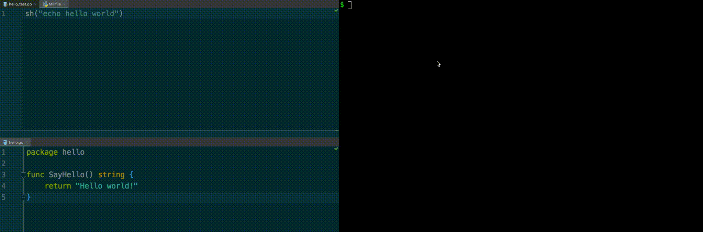

Bonjour! Je m'appelle Michel—pronounced mee-shell (/mi.ʃɛl/). Coincidentally, that's also how you pronounce `mish`, which stands for **Mi**ll **Sh**ell. Feel free to imagine the rest of this document in an outrageous French accent as I help you get `mish` up and running.

I'm an early experiment, not a finished product, but I bet I can still make your workflow a little bit better. Read more [on the Windmill Blog](https://medium.com/windmill-engineering/mish-cruise-control-for-developers-98629709b5ec).



## Getting the binary
If you're running macOS or Linux, you can download a pre-compiled binary from [**our releases page**](https://github.com/windmilleng/mish/releases). Otherwise, you can install via the Go toolchain. First [install Go](https://golang.org/doc/install#install) and make sure that you've added `/usr/local/go/bin` to the `PATH` environment variable. Then install `mish` with:
```bash
go get -u github.com/windmilleng/mish/cmd/mish
```

## Using `mish`

Configuration happens in your `notes.mill`. Make one to get started:
```bash
echo "sh(\"echo hello world\")" > notes.mill
```

### Hotkeys
* `↓`/`↑`: scroll down/up
* `PgDn`/`PgUp`: page down/up
* `j`/`k`: jump down/up one command
* `o`: expand/collapse current command output
* `r`: run your `notes.mill`
* `f`: select a workflow to run from your `notes.mill`
* `q`: quit

### Available Mill Functions
* `sh`: execute arbitrary shell commands
  * `sh("my shell command")`
  * Normally, when a your shell commands exits with a non-zero status code, `mish` will abort the whole execution. To continue execution if a given command fails, specify `sh("faily command", tolerate_failure=True)`

### Example notes.mill
```python
### Commands to execute
sh("make proto")
sh("go build ./server")
sh("go test server", tolerate_failure=True) # if this exits w/ non-zero code, keep going
sh("go test common")
```

## Fun with Mish
There are a few other unique things you can do with mish.

### Use functions to run different shell commands
Mish functions are called workflows and are prefixed by `wf_`. Once you've defined workflows in your `notes.mill`, you can bring up the list of your workflows by pressing `f` within mish, cycle through with your arrow keys, and press `r` to run. If your command is defined outside of a function, it will run automatically.


### Run two mishes at once
You can use mish to run a server in one mish window and simultanously run commands on that server in another mish window. Also, by implementing workflows in your `notes.mill`, you can edit the server and commands you're running and rerun them easily in each window.


The `notes.mill` from the above gif is included in part here as an example of workflows:

```python
def wf_curlserver():
  sh("curl localhost:8080")

def wf_jsserver():
  sh("node ./server.js")

def wf_goserver():
  sh("go run ./main.go")
```

## Tell Us What You Think!
Tried `mish`? Loved it? Hated it? Couldn't get past the install? [**Take our survey**](https://docs.google.com/forms/d/e/1FAIpQLSf8UXLG0FOeMswoW7LuUP02CeUwKBccJishJKDE_VyOqe7g_g/viewform?usp=sf_link) and tell us about your experience. Your feedback will help us make dev tools better for everyone!

### Guiding Questions for Alpha Users
If you're one of our amazing alpha users, thank you! We appreciate you taking the time to test our product and give us feedback. Here are some things that we'd love for you to keep in mind as you test out `mish` so we can pick your brain about them later:
1. When do you find yourself editing `notes.mill`? If it occurs to you to edit `notes.mill` and you don’t, why?
2. When are you still using your shell instead of mish? Why?
3. Did you get annoyed/distracted by `mish`, or turn it off?
4. How does writing in Mill (our configuration language) feel? Intuitive? Annoying?
5. How has `mish` changed your workflow? (Alternately: how does it fit into your existing workflow?)
